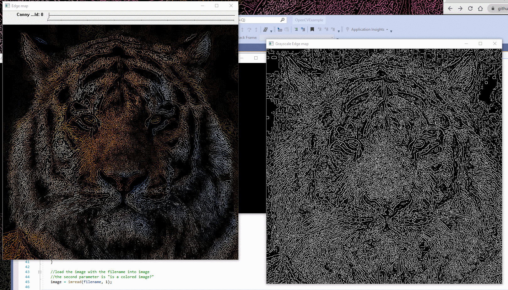

# Nov 17, 2020 - Apply Canny Edge Detection

## Purpose: 
* Find edges that fits the image

### Basic Idea:
1. Change the image into the grayscale image
2. Blur the image
3. Define a threshold to apply Canny Edge Detection
    
 

## Environment:

* Programming Languages: 
    * C++
* Microsoft Visual Studio 2017
* OpenCV 3.2 (x64)

 

## How to build: 
1. Open \vc15-3.2\OpenCVExample.sln in Visual Studio
2. In Menu, select "Build"->"Build Solution"

## How to run:
### In visual studio
1. Bulid Solution
2. Open \vc15-3.2\OpenCVExample.sln in Visual Studio
3. In Menu, select "Debug"->"Start Without Debugging"
### In cmd.exe
1. get into the directory with the image you want to load in the cmd.exe
2. copy the path of "OpenCVExample.exe" in vc15-3.2\x64\Release\
3. input "[path] [image_name]" in cmd.exe

## How to modify source code:
1. Modify \vc15-3.2\OpenCVExample\OpenCVExample.cpp

 

## How to adjust threshold:
There will be a trackbar in Edge Map to change threshold of the filter. 