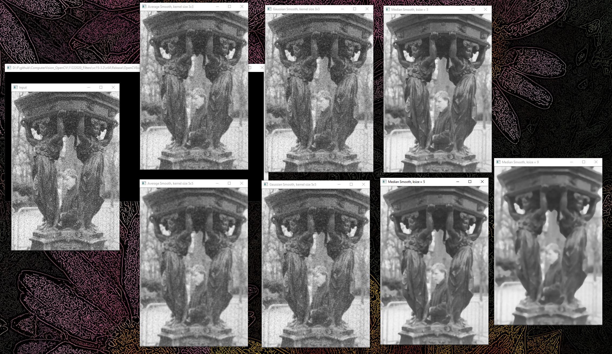

# Nov 22, 2020 - Filters

## Purpose: 
* Apply the filter to smooth noises in a picture 

### Basic Idea:
1. Import the image
2. Apply 3 kinds of image filters: 
    * Average Filter
    * Gaussian Filter
    * Median Filter
3. Then all smoothed outputs will be shown
    
 

## Environment:

* Programming Language: 
    * C++
* Microsoft Visual Studio 2017
* OpenCV 3.2 (x64)

 

## How to build: 
1. Open \vc15-3.2\OpenCVExample.sln in Visual Studio
2. In Menu, select "Build"->"Build Solution"

## How to run:
### In visual studio
1. Bulid Solution
2. Open \vc15-3.2\OpenCVExample.sln in Visual Studio
3. In Menu, select "Debug"->"Start Without Debugging"
### In cmd.exe
1. get into the directory with the image you want to load in the cmd.exe
2. copy the path of "OpenCVExample.exe" in vc15-3.2\x64\Release\
3. input "[path] [image_name]" in cmd.exe

## How to modify source code:
1. Modify \vc15-3.2\OpenCVExample\OpenCVExample.cpp

 

## How to adjust ksize or kernel size:
1. Average Filter:
    * blur(InputArray src, OutputArray dst, Size(int a, int b));
    * Size(int a, int b) is the size of the filter kernel
    * a, b can be all integers
2. Gaussian Filter:
    * GaussianBlur(InputArray src, OutputArray dst, Size(int a, int b), 0);
    * Size(int a, int b) is the size of the filter kernel
    * a, b must be odd integers
3. Median Filter:
    * medianBlur(src, dst, int ksize);
    * ksize must be an odd integer